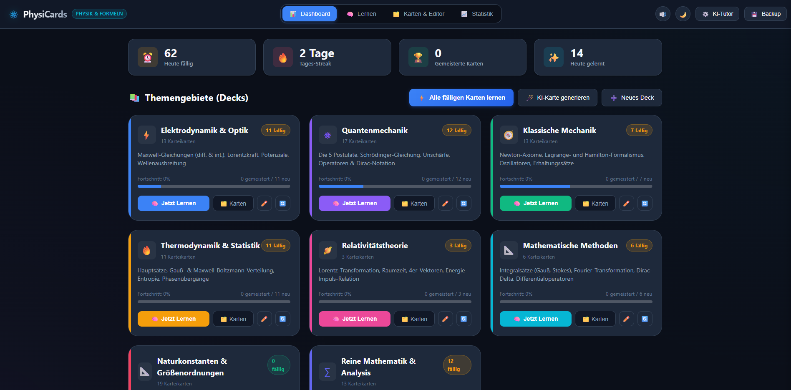

# PhysiCards - Physik & Mathematik Karteikarten-App

Ein spezialisiertes Lernsystem für Physik, höhere Mathematik und Naturwissenschaften. Basierend auf dem wissenschaftlich fundierten SuperMemo SM-2 Spaced-Repetition-Algorithmus, gestochen scharfem LaTeX-Rendering (100% Offline), aktiver Formel-Herleitung und optionalem sokratischem KI-Tutor via Google AI Studio.

<p align="center">
  
  
  
  
  
</p>

---




## Motivation & Methodik

Das Erlernen physikalischer und mathematischer Gesetzmäßigkeiten erfordert mehr als passive Memorisierung. PhysiCards unterstützt ein vertieftes Verständnis durch:

1. **Aktive Herleitung:** Ein integrierter Formel-Kritzelblock (Whiteboard) zur handschriftlichen Skizzierung vor dem Aufdecken der Lösung verhindert den Wiedererkennungs-Trugschluss.
2. **Mathematische Präzision:** Vollständige Unterstützung von Vektornotation, Tensoren, Differentialoperatoren, Integralen und SI-Einheiten via KaTeX.
3. **Didaktische Tiefenschärfe:** Jede Karte gliedert sich standardisiert in Formel, Variablen mit Einheiten, physikalische Intuition und Gültigkeitsgrenzen (z. B. Grenzfälle für $v \ll c$ oder $T \to 0$).
4. **Optimierte Wiederholungsintervalle:** SuperMemo SM-2 Algorithmus zur systematischen Überwindung der menschlichen Vergessenskurve.

---

## Funktionsumfang

### 1. Spaced Repetition (SuperMemo SM-2)
- Wissenschaftliche Berechnung optimaler Wiederholungsabstände basierend auf Wiederholungsanzahl ($n$), Intervall ($I$) und Leichtheitsfaktor ($EF$).
- Live-Intervallprognose direkt auf den vier Bewertungs-Schaltflächen (`[1] Nochmal`, `[2] Schwer`, `[3] Gut`, `[4] Einfach`).
- Dynamisches Fehlermanagement (Lapses): Karten mit Bewertung „Nochmal“ werden unmittelbar ans Ende der aktuellen Lerneinheit gestellt, um sie im Kurzzeitgedächtnis zu reaktivieren.

### 2. Aktiver Formel-Kritzelblock (Active Scratchpad)
- Transparente Zeichenfläche zur Vorzeichnung von Formeln, Integrationswegen und Vektordiagrammen direkt über der Karte.
- Unterstützung für Maus-, Stift- und Touch-Eingabe mit Löschfunktion und Tastaturkürzel (`W`).

### 3. Offline KaTeX-Formelrendering
- Mathematische Formeldarstellung inline (`$...$`) und abgesetzt (`$$...$$`).
- Alle KaTeX-Skripte, Stylesheets und Schriften sind lokal gebündelt; die Software funktioniert vollständig ohne aktive Netzwerkverbindung.

### 4. Didaktische Strukturierung
Standardisierte Gliederung jeder Karte:
- **Mathematische Definition:** Exakte Formel in sauberer LaTeX-Syntax.
- **Variablen & Konstanten:** Detailliertes Verzeichnis inklusive standardisierter SI-Einheiten.
- **Physikalische Intuition:** Veranschaulichungen, Analogien und Gedankenexperimente.
- **Gültigkeitsbereich:** Physikalische Randbedingungen, Annahmen und Grenzfälle.

### 5. Sokratischer KI-Tutor (Google AI Studio & Gemini 3)
- Optionaler Chat-Drawer zur Diskussion von Karteninhalten, Herleitungen und Grenzfällen (Tastaturkürzel `T`).
- Stufenlose Skalierung der Fensterbreite per Maus (Drag-to-Resize) mit automatischer Speicherung der bevorzugten Ansicht.
- Strukturierte Schnellaktionen: Alltags-Analogien, sokratische Verständnisfragen, mathematische Herleitungen und typische Denkfallen.
- Vollständige Privatsphäre: Der API-Key wird rein lokal auf dem Rechner gespeichert.

### 6. Automatisierte Kartenerstellung
- Erstellung standardisierter Karten direkt aus dem KI-Chat.
- Modale Direkterstellung über die Schaltfläche „KI-Karte generieren“: Eingabe eines Themas erzeugt eine vollständige Karteikarte mit LaTeX-Gleichung, Variablen und Intuition.

### 7. Live Split-Screen Editor & Deck-Verwaltung
- Zwei-Spalten-Editor mit synchronisierter KaTeX-Vorschau in Echtzeit.
- Formel-Werkzeugleiste für mathematische Symbole.
- Umfassende Deck-Verwaltung: Erstellen, Bearbeiten, Löschen, Festlegen von Akzentfarben und Symbolen.

### 8. Datensicherung & Export
- Vollständiger 1-Klick JSON-Export und -Import aller Karten, Decks und des gesamten Lernfortschritts.
- Anki-kompatibler Export im TSV-Format.

---

## Schnellstart & Installation

### Voraussetzungen
- Python 3.10 oder höher

### 1. Repository klonen
```bash
git clone https://github.com/DEIN-BENUTZERNAME/PhysiCards.git
cd PhysiCards
```

### 2. Abhängigkeiten installieren
```bash
pip install -r requirements.txt
```

### 3. Anwendung starten

**Unter Windows per Skript:**
Doppelklick auf die Datei `start.bat`.

**Über die Kommandozeile (Desktop-Fenster via PyWebView):**
```bash
python main.py
```

**Direkt im Standard-Webbrowser öffnen:**
```bash
python main.py --browser
```
Die lokale Server-Adresse lautet: `http://127.0.0.1:5055`

---

## Enthaltene Standard-Decks (8 Decks & 95 Fachkarten)

Beim ersten Start initialisiert die Software automatisch eine lokale Datenbank mit 95 Fachkarten in 8 Themengebieten:

1. **Reine Mathematik & Analysis:**
   $L^2$-Raum und Norm, Skalarprodukt $\langle f, g \rangle$, Vollständigkeit und Satz von Riesz-Fischer, Cauchy-Schwarz-Ungleichung, Minkowski-Dreiecksungleichung, Geometrische Reihe, Harmonische Reihe (logarithmische Divergenz und Euler-Mascheroni-Konstante), Basler Problem ($\sum 1/n^2 = \pi^2/6$), Leibniz-Kriterium und alternierende Reihen, Taylor-Reihen ($e^x, \sin x, \cos x$), Cauchy-Hadamard-Konvergenzradius, Parsevalsche Identität in $L^2$, Spektralsatz für selbstadjungierte Operatoren.
2. **Naturkonstanten & Größenordnungen:**
   Fundamentale Konstanten ($c, h, \hbar, e, m_e, m_p, k_B, N_A, R, G, g, \varepsilon_0, \mu_0, a_0, \alpha \approx 1/137, \sigma$), Fermi-Abschätzungen (Sekunden im Jahr $\approx \pi \times 10^7\,\mathrm{s}$, thermische Energie $k_B T \approx 25\,\mathrm{meV}$, Schallgeschwindigkeit, Sonnen- und Erdmassen, Wellenlängen und Photonenenergien des sichtbaren Lichts).
3. **Quantenmechanik:**
   Die fünf Postulate, Schrödinger-Gleichung, Heisenbergsche Unschärferelation ($\Delta x \Delta p$ und $\Delta E \Delta t$ mit Zerfallsbreite $\Gamma = \hbar/\tau$), De-Broglie-Wellenlänge, Impuls-Wellenvektor-Beziehung ($p = \hbar k$), Planck-Einstein-Relation ($E = \hbar\omega$), harmonischer Oszillator mit Leiteroperatoren $\hat{a}, \hat{a}^\dagger$, Pauli-Spinmatrizen.
4. **Klassische Mechanik:**
   Newtonsche Axiome, Lagrange-Gleichungen 2. Art, Hamiltonsche kanonische Gleichungen, harmonischer Oszillator, Noether-Theorem, Fluchtgeschwindigkeit, Fadenpendel, Zentripetalkraft, Drehimpulserhaltung und Pirouetteneffekt.
5. **Elektrodynamik & Optik:**
   Maxwell-Gleichungen (differentiell und integral), Lorentzkraft, Kontinuitätsgleichung, Poynting-Vektor, Ohmsches Gesetz und Verlustleistung ($P=UI=I^2R$), Kapazität und Feldenergie des Kondensators, Spulenenergie, Thomson-Schwingkreis, Brechungsgesetz von Snellius, Lichtgeschwindigkeit $c = 1/\sqrt{\varepsilon_0\mu_0}$.
6. **Thermodynamik & Statistische Physik:**
   Vier Hauptsätze der Thermodynamik, Gauß-Normalverteilung, Maxwell-Boltzmann-Geschwindigkeitsverteilung, Boltzmann-Entropie $S = k_B \ln \Omega$, Äquipartitionstheorem, Ideale Gasgleichung, Carnot-Wirkungsgrad, Stefan-Boltzmann-Gesetz, Bernoulli-Gleichung und hydrostatischer Druck.
7. **Mathematische Methoden der Physik:**
   Gaußscher Integralsatz, Stokesscher Integralsatz, Dirac-Delta-Distribution, Fourier-Transformation, Taylor-Reihen und Kleinwinkelnäherungen, Gaußsches Fehlerintegral.
8. **Relativitätstheorie:**
   Spezielle Lorentz-Transformation, Zeitdilatation, Längenkontraktion, Relativistische Energie-Impuls-Beziehung $E^2 = (pc)^2 + (m_0 c^2)^2$.

---

## Tastaturkürzel

| Taste | Funktion |
|---|---|
| `Leertaste` | Karte umdrehen (Antwort aufdecken) |
| `1` | Bewertung: **Nochmal** (< 10 min) |
| `2` | Bewertung: **Schwer** |
| `3` | Bewertung: **Gut** |
| `4` | Bewertung: **Einfach** |
| `W` | Formel-Kritzelblock (Whiteboard) ein-/ausblenden |
| `E` | Aktuelle Karte im Live-Editor bearbeiten |
| `T` | Sokratischen KI-Tutor öffnen/schließen |
| `Esc` | Modals / Chat schließen bzw. zurück zum Dashboard |

---

## Projektstruktur

```
PhysiCards/
├── app.py                  # Flask REST-API und Anwendungsrouten
├── main.py                 # Desktop-Window Launcher (PyWebView und Browser-Fallback)
├── start.bat               # Windows-Startskript
├── requirements.txt        # Python-Abhängigkeiten
├── .gitignore              # Git-Ausschlussregeln (schützt cards.db und lokale Caches)
├── core/
│   ├── models.py           # Dataclasses für Decks, Cards, ReviewState
│   ├── sm2.py              # SuperMemo SM-2 Algorithmus
│   ├── storage.py          # SQLite-Persistenzschicht und Statistiken
│   ├── default_decks.py    # 8 Standard-Decks und 95 Fachkarten
│   └── gemini_service.py   # Google AI Studio / Gemini 3 SSE-Streaming und Tutor
├── data/
│   └── .gitkeep            # Lokales Datenverzeichnis (cards.db wird lokal erzeugt)
├── static/
│   ├── index.html          # Single-Page Frontend
│   ├── css/style.css       # Responsive Dark/Light Stylesheets
│   ├── js/
│   │   ├── app.js          # Hauptanwendungslogik und Benutzeroberfläche
│   │   ├── scratchpad.js   # Canvas Formel-Kritzelblock
│   │   └── audio.js        # Web Audio API Signale
│   └── vendor/katex/       # Offline KaTeX-Engine und Zeichensätze
└── tests/
    ├── test_sm2.py         # SM-2 Intervall- und Progressions-Tests
    ├── test_storage.py     # SQLite CRUD- und Seed-Tests
    ├── test_api.py         # REST-API Integrationstests
    ├── test_gemini.py      # Prompt-Builder, LaTeX-Sanitizer und Mock-Tests
    └── test_system.py      # KaTeX-Fonts und Offline-Asset-Tests
```

---

## Datenschutz & Sicherheit

- **Lokale Speicherung:** Sämtliche Lernfortschritte, Notizen und Bewertungsdaten verbleiben ausschließlich in der lokalen SQLite-Datenbank (`data/cards.db`).
- **Keine Telemetrie:** Es werden keine Analysedaten, Nutzungsstatistiken oder Tracking-Cookies übertragen.
- **Sicherheit des API-Keys:** Der optionale Google AI Studio API-Key wird nur lokal abgelegt und verlässt das System ausschließlich als Autorisierungs-Header direkt zu den offiziellen Endpunkten von Google. Über die beiliegende `.gitignore` ist sichergestellt, dass private Datenbankdateien und Schlüssel nicht versehentlich in öffentliche Versionsverwaltungen hochgeladen werden.

---

## Tests

Die gesamte Testsuite (24 automatisierte Tests) lässt sich ohne zusätzliche Test-Frameworks über das Python-Standardmodul ausführen:

```bash
python -m unittest discover tests
```

---

## Lizenz

Dieses Projekt steht unter der [MIT-Lizenz](LICENSE).
